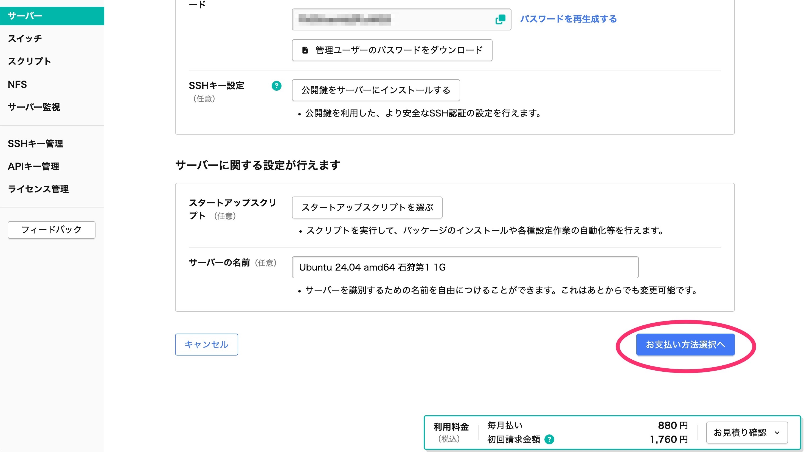
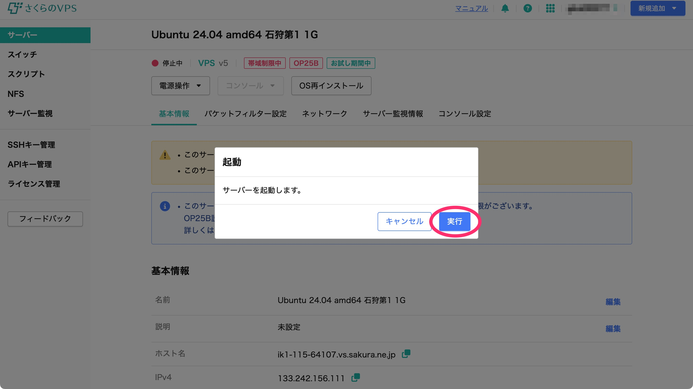
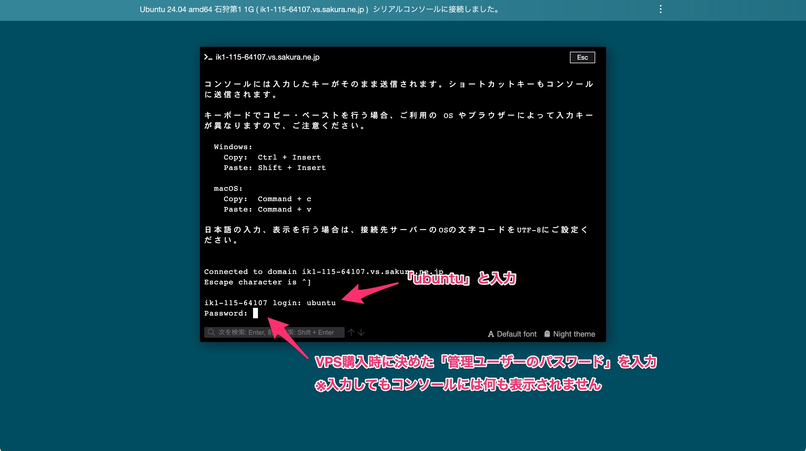

# Ubuntuサーバーのセットアップ
※みらいサーバーをお使いの方はこの手順はスキップしてください。

## VPSの購入

さくらVPSにログインして、画面右上の「サーバーの追加」プルダウンから「VPS」を選択。

OSは「Ubuntu」、バージョンは「24.04」を選択。

プランはひとまず最も安い「1Gプラン」を選択。
次に、リージョンは「石狩第1」を選択しましょう。料金が安くなります。

管理ユーザーのパスワードは「自動生成したパスワードを使う」を選択。
生成されたパスワードはメモっておきましょう。

その他はいじらず「お支払い方法選択へ」を選択。

支払い方法を入力。

「2週間お試し」を利用すると2週間だけ無料で使えてキャンセルができます。試しにVPSを建ててみたいという人は選んでおくと良いでしょう。

購入手続きが完了して数分経つとサーバー一覧画面に購入したサーバーが表示されます。
※資料では説明を分かりやすくするためIPアドレスやホスト名を映していますが無闇に人には見せない方が良いでしょう。

## VPSの起動・ログイン
サーバー一覧の画面から購入したサーバーを選択。
「電源操作」のプルダウンをクリックし「起動する」を選択。

「実行」をクリック。

サーバーの状態が「稼働中」に変わっている。

「コンソール」プルダウンをクリックし「シリアルコンソール」を選択。

このような画面が開きます。

Enterキーを押すとログイン情報を求められるので、「ubuntu」→「最初に決めたパスワード」の順で入力。

ログインが成功するとこのような画面になります。
