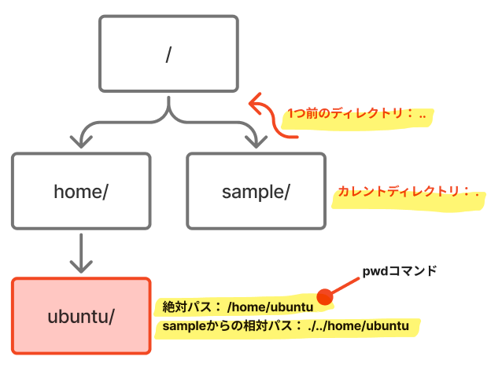
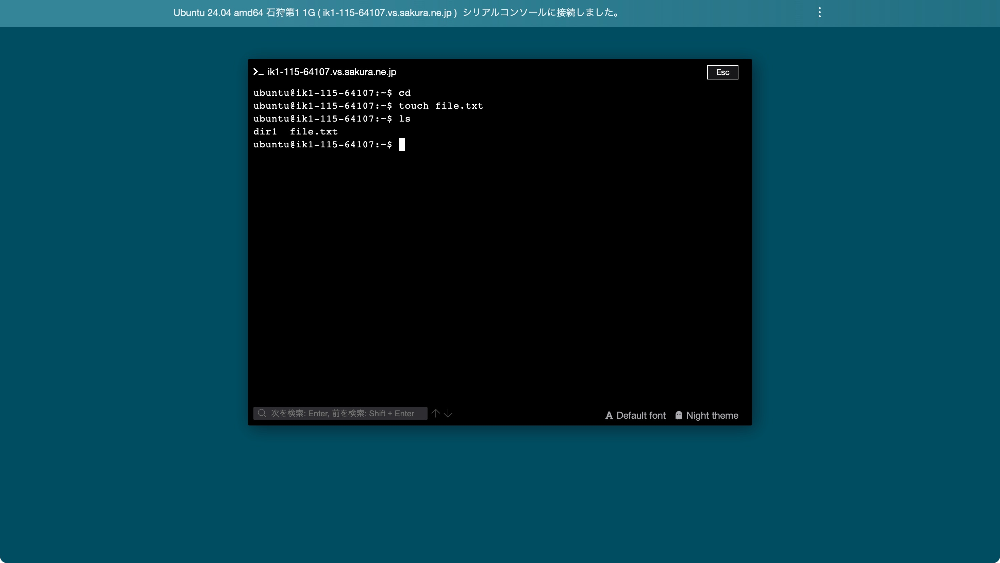
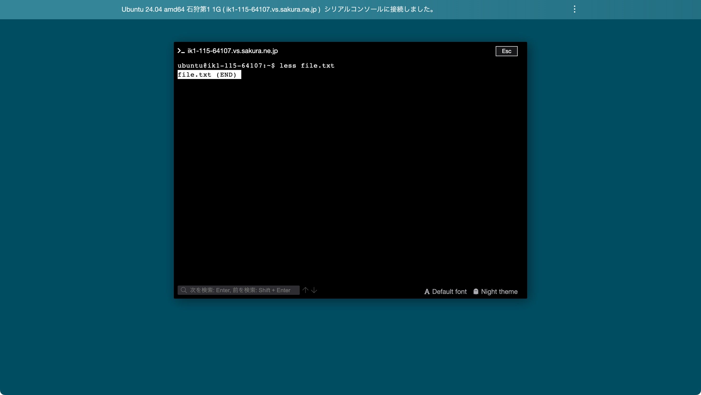
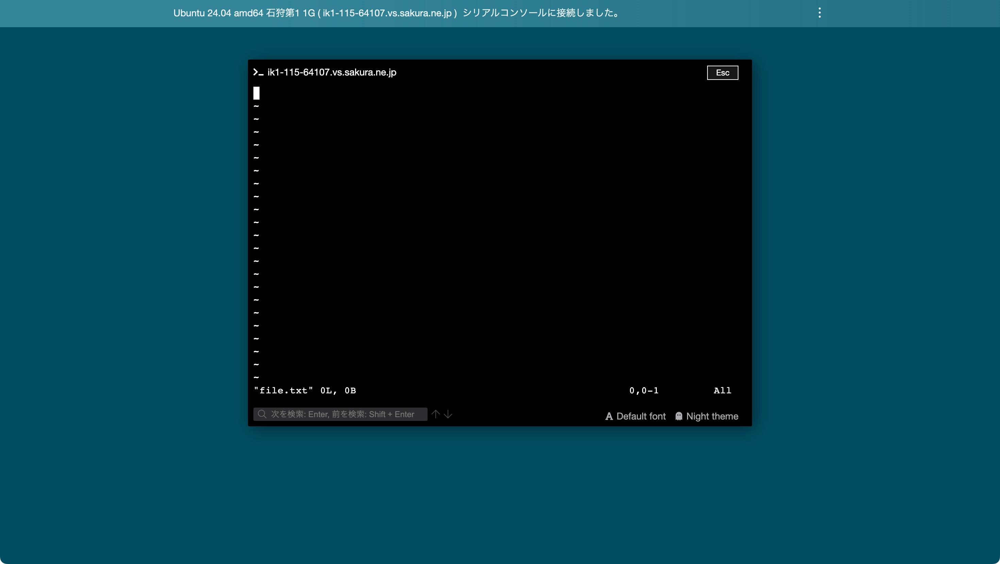
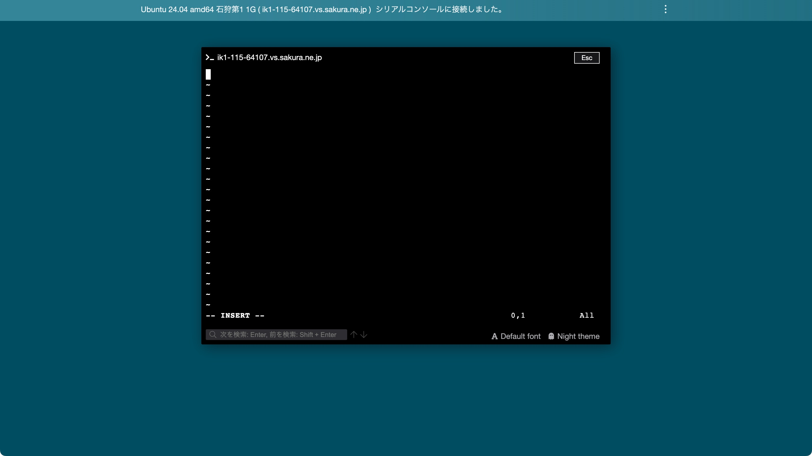
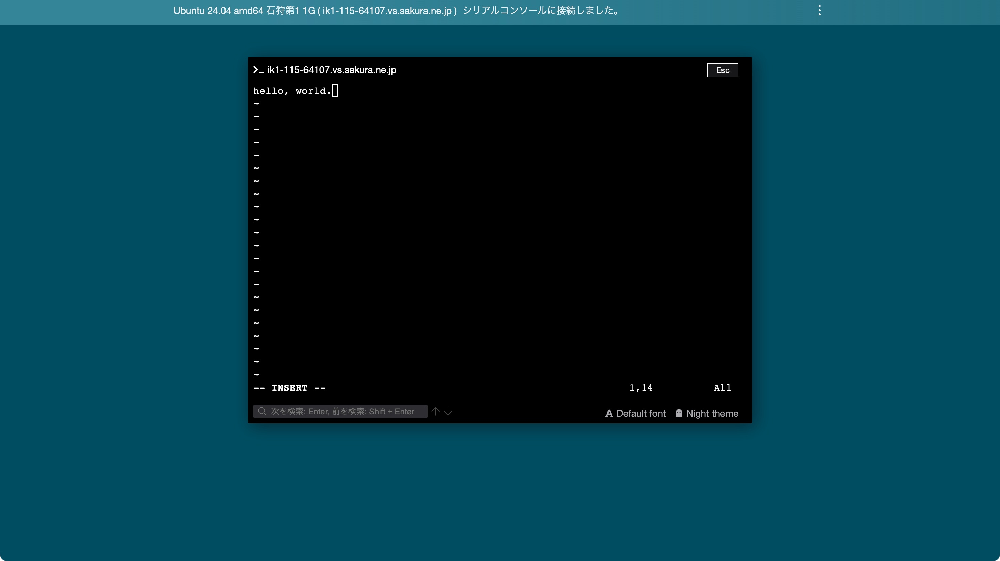
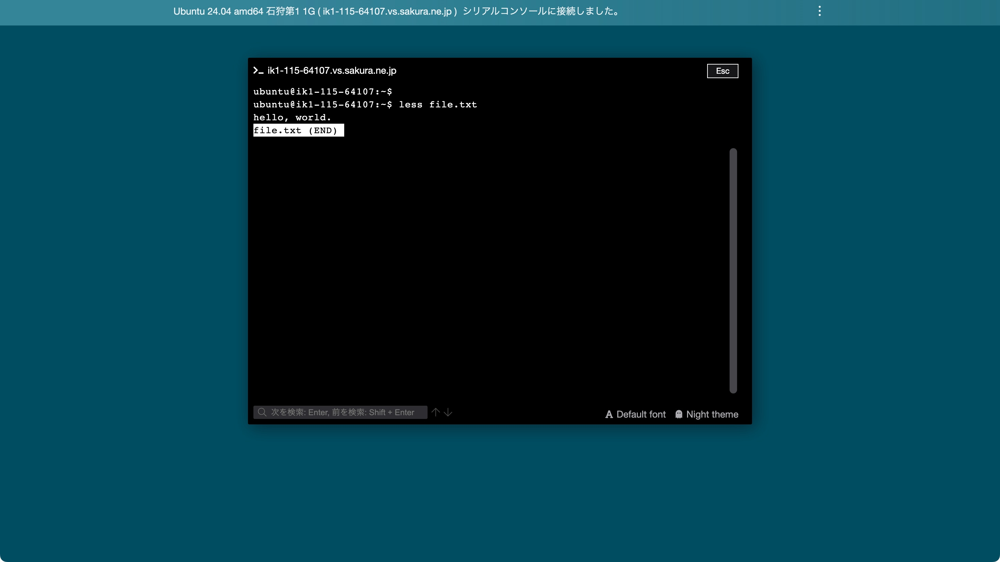

# Linuxの基本的な使い方

## ディレクトリ

まずはLinuxを扱うにあたって重要な「ディレクトリ」について手を動かしながら学んでいただきます。

### pwd

まずはコンソール上で「pwd」と入力してEnterを入力してください。

`/home/ubuntu`と表示されました。これは「ディレクトリ」と呼びます。Linuxではツリー状にディレクトリが管理され、ディレクトリの中にファイルを保存します（"フォルダ"と言った方がピンと来るかもしれません）。コンソールではこのディレクトリを移動しながら「Linuxコマンド」を入力し操作していきます。`pwd`は現在自分が操作対象としているディレクトリ（「カレントディレクトリ」）の「パス」を表示するLinuxコマンドです。

`/`（「ルートディレクトリ」）を基点として、その下にディレクトリやファイルが入れ子のように存在します。今回で言えばカレントディレクトリは`ubuntu`であったため、そのパスは`/home/ubuntu`となります。このようにルートディレクトリからのパスを「絶対パス」と呼びます。

絶対パスの対になる言葉として「相対パス」というものもあります。これはカレントディレクトリからのパスを示しています。例えば上の画像の`sample`というディレクトリから見た`ubuntu`ディレクトリへの相対パスは`./../home/ubuntu`となります。`.`がカレントディレクトリを表し、`..`が1つ上位のディレクトリを表します。

### cd
では実際にディレクトリを移動してみましょう。ディレクトリの移動には「cd」コマンドを用います。コンソールに`cd ..`と入力しEnter、その後`pwd`を入力しEnterしてください。

`/home`とだけ表示されるようになったと思います。cdコマンドはカレントディレクトリを変更するもので、`cd`の後に移動したいディレクトリを入力します。今回は1つ上位のディレクトリを表す`..`を入力したので、`ubuntu`の上位の`home`ディレクトリに移動しました。相対パス・絶対パスどちらにも対応しているので、`cd /home`と入力しても同じ結果となります。

### mkdir

では次はディレクトリを新しく作ってみましょう。まずコンソールで`cd`とだけ入力してEnterを押してください。

`pwd`コマンドで確認すると`/home/ubuntu`に戻っていることが確認できました。`cd`とだけ入力すると「ホームディレクトリ」へ一発で移動することができます。ホームディレクトリとはそのユーザー用に作られたディレクトリです。ユーザー名がそのままディレクトリ名になります。

ちなみにコンソールの`$`の左横に表示される文字列はカレントディレクトリを新たしており、`~`という文字列はホームディレクトリの省略形です。

次にディレクトリを新たに作ります。`mkdir dir1`と入力してください。

`cd dir1`と入力すると作成したディレクトリへ移動できるようになりました。このようにしてディレクトリが必要な場合は作成していきます。

### ls

特定のディレクトリの中身に何があるか知りたいときは`ls`コマンドを使いましょう。`cd`コマンドでホームディレクトリへ戻って`ls`と入力してEnterを押すと、先ほど作成した`dir1`ディレクトリが表示されるようになっています。

## ファイル

続いて実際のコードなどを書く「ファイル」の操作方法について解説します。

### touch

まずはファイルを新規で作ります。`cd`コマンドでホームディレクトリへ移動した上で、`touch file.txt`と入力してEnterを押してみましょう。

`ls`で確認するとファイルが作成されていることが確認できます。`touch {ファイル名}`でファイルを作成することができます。

### less

ファイルの中身を確認してみます。`less file.txt`と入力してEnterを押してみてください。

コマンドを実行させておいてなんですが、現状ファイルの中身は空っぽなので、`file.txt (END)`というファイルの終わりを表す表示がすぐ下に出てくるだけになっています。

`q`キーを押すと元に戻ることができます。

では次は実際にファイルの中身を記述していきましょう。

### vim

ファイルの編集には`vim`コマンドを使います。まず`vim file.txt`とコンソールに入力してEnterしてください。

これは`vim`というテキストエディタが起動している状態です。Windowsに「メモ帳」があるようにLinuxには「vim」があります。今この状態はVISUALモードと呼ばれ、中身の閲覧だけができる状態です。ここからINSERTモードに移行します。

`i`キーを押してください。

「INSERT」と表示されました。これで編集ができます。適当に入力してみましょう。

入力し終えたらこの状態を保存します。まずは`Esc`キーを押し、その後`:wq`と入力しEnterを押してください。vimが終了し元のターミナルの画面に戻ったと思います。`:wq`は`w`が保存、`q`がvimの終了を意味するコマンドです（なので`:w`、`:q`とそれぞれ単独で実行することもできます）。

では最後にファイルの中身がちゃんと更新されているか、`less`コマンドで確認しましょう。

vimは慣れるまでが大変ですが慣れると素早く入力を行うことができます。様々なコマンドが用意されていますので、ぜひ調べて使ってみましょう。