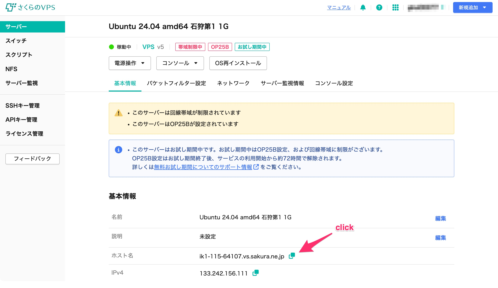

# Nginxのインストール

### Webサーバー
「Webサーバー」とは一般的に、インターネットに接続されていてクライアント（ブラウザなど）からのリクエストに応じて何らかの情報を返すコンピュータやソフトウェアのことを言います。この章では皆さんに立ててもらったVPSをWebサーバーにしていきます。

その前にまず現時点でVPSに通信をするとどうなるのか見てみましょう。さくらVPSのサーバー一覧画面から、作成したVPSを選び、基本情報の「ホスト名」をコピー、適当なブラウザのアドレスバーにペーストしてアクセスしてみましょう。

おそらく何も表示されず、Chromeであれば「応答時間が長すぎます」といった表示になるのではないかと思います。

まだVPSがWebサーバーとしてセットアップされておらず、クライアントに応答を返せる状態になっていないため、このような挙動になります。

### Nginx

今回はWebサーバーとして「Nginx（えんじんえっくす）」というソフトウェアをインストールしていきます。

ターミナルに`sudo apt install nginx`と入力して実行してみてください。

途中で何やら質問をされることがありますが、`Y`と入力してEnterで大丈夫です。

インストールが完了したらコンソールに`nginx -v`と入力してみてください。インストールしたnginxのバージョンが表示されたら成功です。

### パケットフィルター

nginxをインストールしましたが、まだこの状態ではじめのURLにアクセスしてもつながりません。もう1つ「パケットフィルター」の設定が必要です。パケットフィルターとは、どういう通信を許可するか？、というVPSへの通信制限を行うものです。これをWebサーバーとして成立するように設定していきます。

VPSの画面から「パケットフィルター設定」をクリックします。

「パケットフィルターを設定」をクリック。

「パケットフィルター設定を追加する」をクリック。

２行目の枠の「フィルターの種類」を「Web」に変更。

「設定を保存する」をクリック。

これでWebサーバーとしての通信が行えるようになりました。

この状態で最初のURLにもう一度アクセスしてみましょう。「Welcome to nginx!」と表示されていたら成功です。

