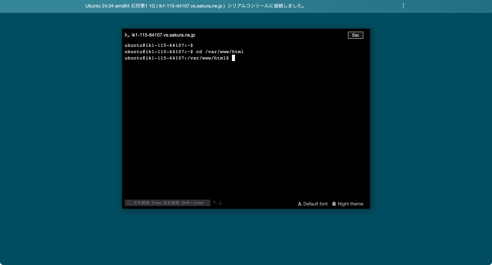
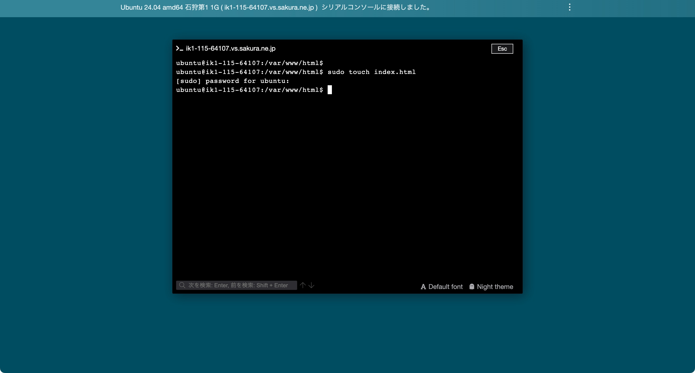
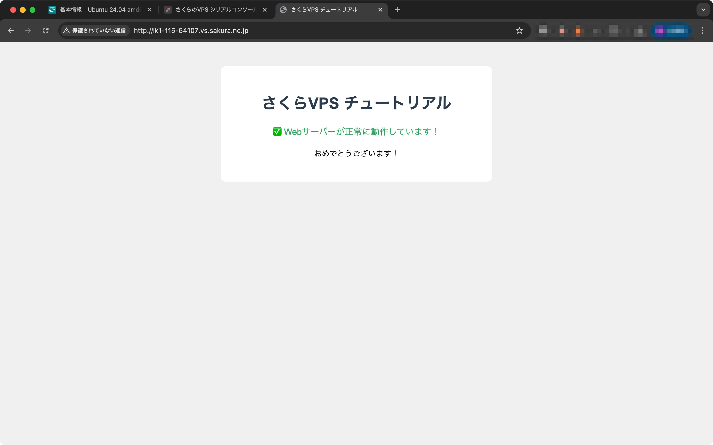
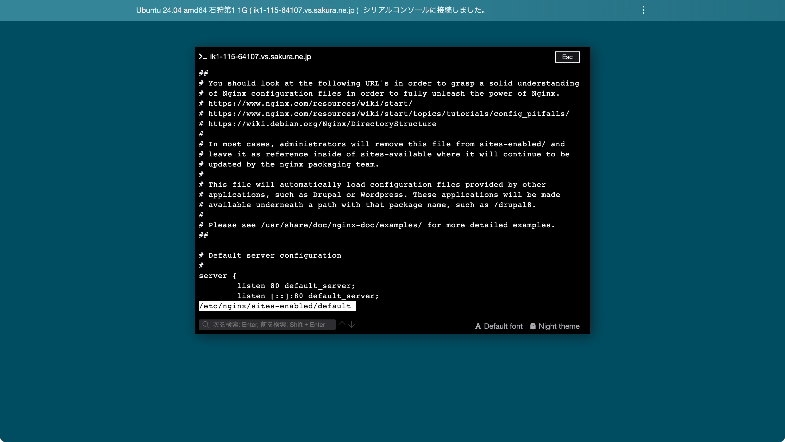
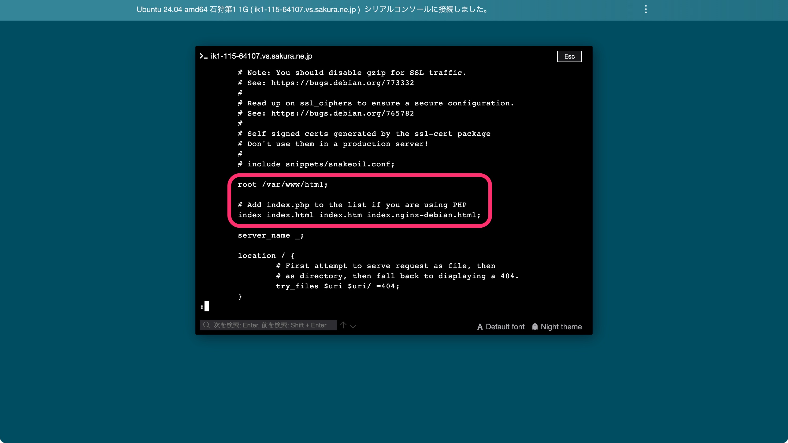
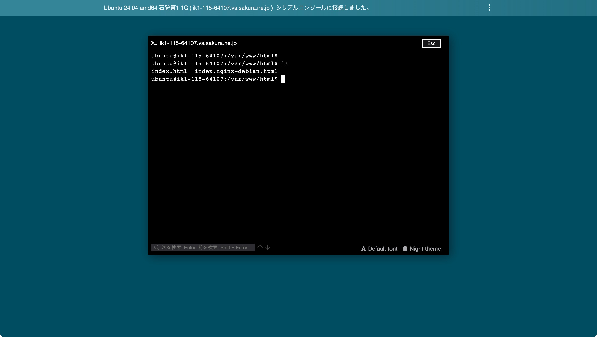
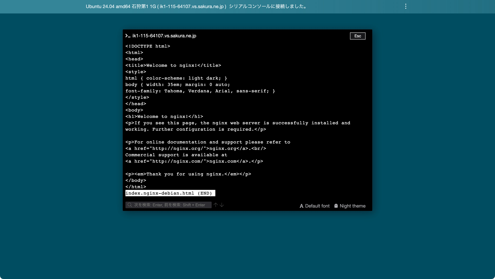
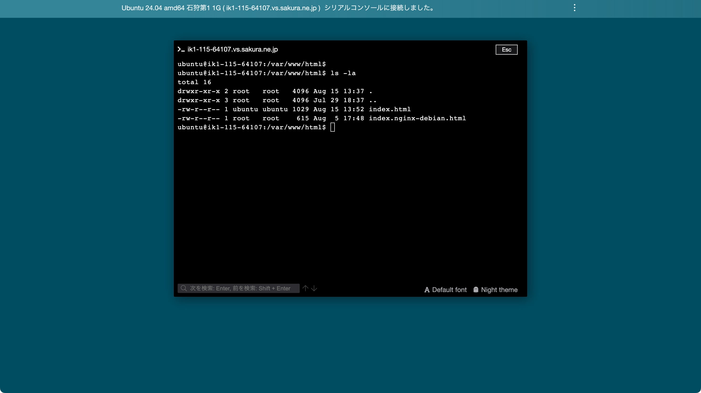
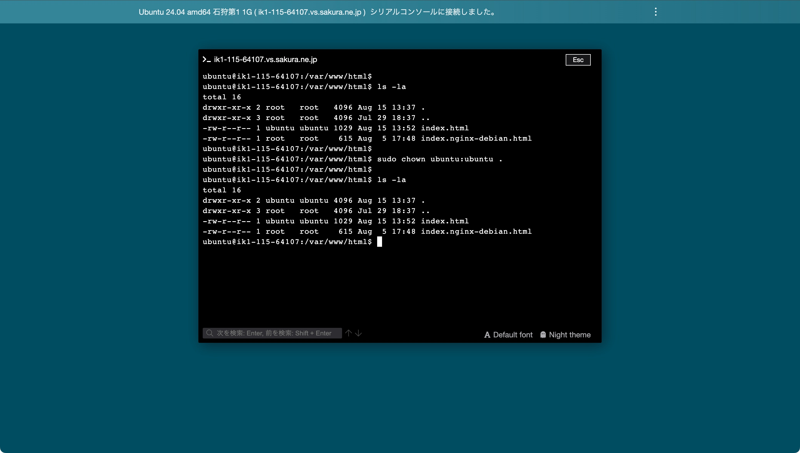

# 独自のHTMLを表示する

自分で作成したhtmlファイルをWebサーバーで表示させたいと思います。

### htmlファイルの作成

`cd /var/www/html`と入力し、ディレクトリを移動してください。



`touch index.html`と入力し、htmlファイルを作成。



`sudo vim index.html`でvimを起動し、以下のコードをindex.htmlに書き込む。

```html
<!DOCTYPE html>
<html lang="ja">
    <head>
        <meta charset="UTF-8">
    <title>さくらVPS チュートリアル</title>
    <style>
        body {
            font-family: Arial, sans-serif;
            text-align: center;
            margin-top: 50px;
            background-color: #f0f0f0;
        }
        .container {
            background-color: white;
            padding: 30px;
            border-radius: 10px;
            max-width: 500px;
            margin: 0 auto;
        }
        h1 {
            color: #2c3e50;
        }
        .success {
            color: #27ae60;
            font-size: 18px;
            margin: 20px 0;
        }
    </style>
</head>
<body>
    <div class="container">
        <h1>さくらVPS チュートリアル</h1>
        <div class="success">
            ✅ Webサーバーが正常に動作しています！
        </div>
        <p>おめでとうございます！</p>
    </div>
</body>
</html>
```

ファイルを更新できたら再度VPSのURLにアクセスしてみてください。表示される画面が上で更新したhtmlの内容になっていれば成功です。



### なぜ表示されるのか

ここまで言われるがままhtmlファイルを作成したと思いますが、なぜこれによって自作のhtmlを表示できるようになったのでしょうか。そもそもなぜ最初のnginxの画面は表示されていたんでしょうか。

コンソールで`less /etc/nginx/sites-enabled/default`を実行してください。



これはnginxの「設定ファイル」になっています。Webサーバーへのリクエストをどのように受け取り、処理するかがここで定義されています。
`↓`キーでスクロールしていくと下記画像の赤枠の行が出てくると思います。



```
root /var/www/html;
```
これ↑はWebサーバーの基点となるディレクトリをどこにするかを設定しています。こうしておくことで、今回の例で言えば `https://ik1-132-72972.vs.sakura.ne.jp/` というURLでアクセスした際、Webサーバーは `/var/www/html` を基点としてレスポンスするべきファイルを探します。

```
index index.html index.htm index.nginx-debian.html;
```

続いてこちら↑は、先頭の`index`以降に記述されたファイルを左から順に探し、最初に見つかったファイルをWebサーバーから返却するという設定です。

ここで一度 `/var/www/html` で `ls` コマンドを実行してみましょう。



お分かりいただけたでしょうか。`index.html`と`index.nginx-debian.html`という2つのファイルがあります。前者は今回自作したもので、後者はnginxをインストールした際に自動的に作成されたものになります。

試しに`less index.nginx-debian.html`とすると「Welcome to nginx!」のhtmlが確認できます。



つまりnginxをインストールした直後は`/var/www/html/index.nginx-debian.html`のファイルしか存在しないためにnginxのhtmlが表示されていましたが、今回`/var/www/html/index.html`というファイルを作成したために、設定ファイル的に`index.html`が優先されて返却されブラウザで表示されたということになります。

設定ファイルは他にも様々な設定が可能です。webシステムを開発しながら、こういう時はどうしたらいいんだろう？と考えながら、少しずつ覚えていくといいでしょう。

### 今後のために

今後の作業の布石として`/var/www/html`の「所有者」を変更しておきます。所有者というのはそのディレクトリやファイルに対するアクセス権限を持つユーザーのことです。

試しにカレントディレクトリが`/var/www/html`の状態で`ls -la`とコマンドを実行してみてください。



`root`や`ubuntu`と表示されているのがそれです。右側にはディレクトリやファイル名が表示されています。`.`がカレントディレクトリを表すので`/var/www/html`の所有者は`root`になっています。これを`ubuntu`に変更しておきます。

`sudo chown ubuntu:ubuntu .`と実行してください。



実行後再度`ls -la`を実行してみて所有者が変わっていれば成功です🎉