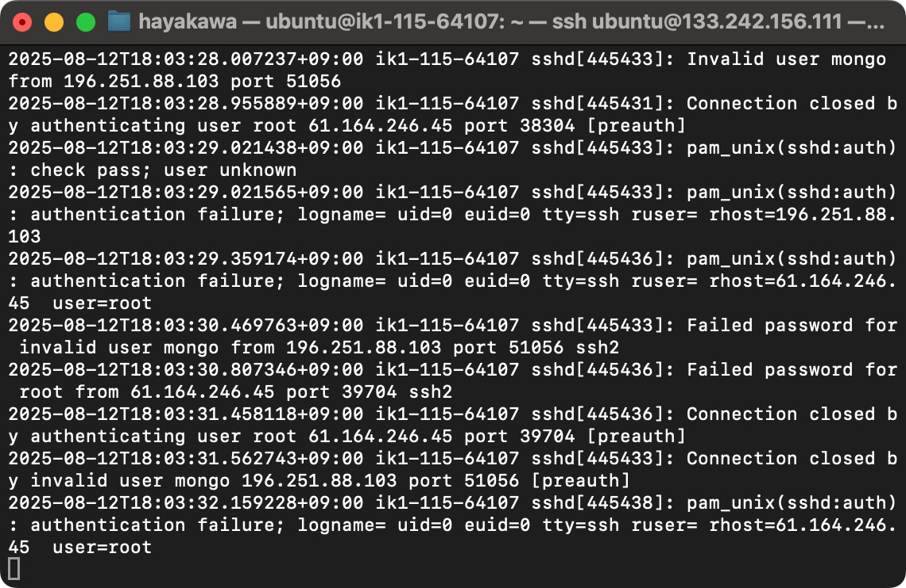

# SSH接続する

これまでブラウザのコンソール上でVPSを操作していましたが、ブラウザでさくらVPSにログインして...サーバーを選んで...コンソールを開いて...というのはちょっと手間だったと思います。この章ではご自身のPCからVPSに対して「SSHログイン」を行い、ブラウザよりも気軽にVPSに入れるようにしたいと思います。

## パスワードでSSHログインする

ssh接続にはVPSを建てる時に設定したubuntuユーザーのパスワードでログインする方法と、「公開鍵認証」というやり方でログインする方法の2種類があります。

### Macの場合

macで「ターミナル」というアプリを開きます。

そこで `ssh ubuntu@{あなたのvpsのipアドレス}`を入力してEnter。

☝️何か聞かれますが `yes` と入れてEnter。

☝️VPSのubuntuユーザーのパスワードを入れます。

コマンドを入力するところの表示が`ubuntu@~~~`に変わったら成功です。

ターミナル上でlinuxコマンドを実行することができます。

### Windowsの場合
※画面はWindows10です

PowerShellを開きます

`C:\Windows\System32\OpenSSH\ssh ubuntu@{あなたのvpsのipアドレス}`を入力してEnter。

☝️VPSのubuntuユーザーのパスワードを入れます。

コマンドを入力するところの表示が`ubuntu@~~~`に変わったら成功です。

## 公開鍵でSSHログインする

前半ではパスワードでsshログインをしていましたが、実はパスワードでのログインはセキュリティ上あまり良くないとされています。理由は総当たりでパスワードを試行すれば頑張れば悪意のある第三者にログインされてしまう可能性があるからです。

試しにコンソール上で `tail -f  /var/log/auth.log`と実行してみてください。

何やらずらずらと「ログ」が流れていっていると思います。実はこれどこかの誰かがこのVPSにsshログインをしようと試みている証です笑
（画面は`control+C`で戻せます）

このようにサーバーというのは常に悪意ある人たちの脅威に晒されているので、もう少しこのVPSのセキュリティを高めたいと思います。その時に用いるのが「公開鍵」です。
（「公開鍵認証」については色々なところで解説されているので調べてみてください。）

### 公開鍵の生成（Mac）

### 公開鍵の生成（Windows）
※画面はWindows10です