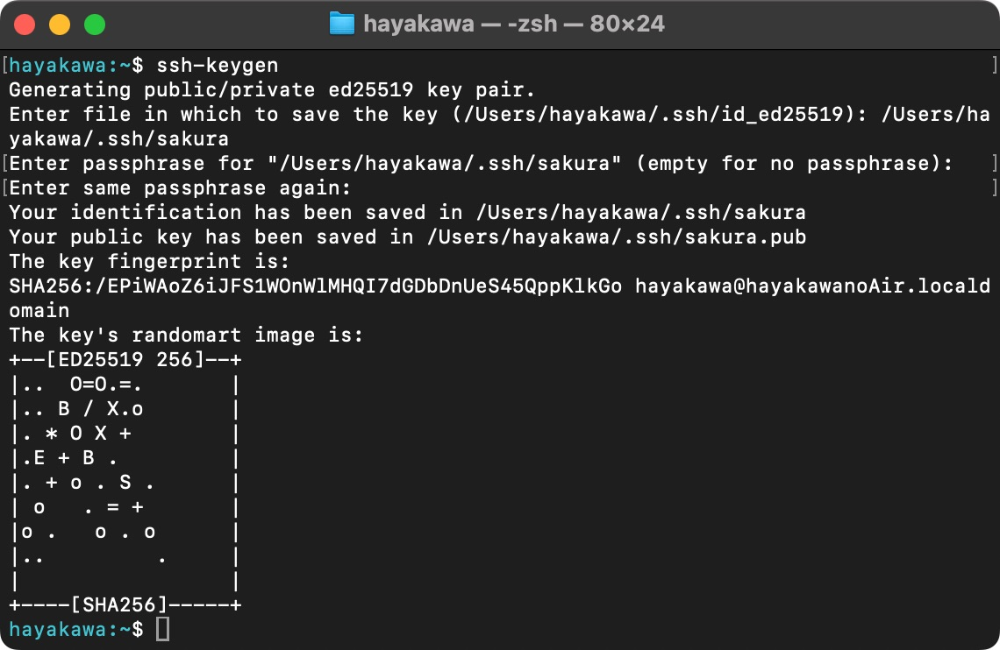

# SSH接続する

これまでブラウザのコンソール上でVPSを操作していましたが、ブラウザでさくらVPSにログインして...サーバーを選んで...コンソールを開いて...というのはちょっと手間だったと思います。この章ではご自身のPCからVPSに対して「SSHログイン」を行い、ブラウザよりも気軽にVPSに入れるようにしたいと思います。

## パスワードでSSHログインする

ssh接続にはVPSを建てる時に設定したubuntuユーザーのパスワードでログインする方法と、「公開鍵認証」というやり方でログインする方法の2種類があります。

### Macの場合

macで「ターミナル」というアプリを開きます。


そこで `ssh ubuntu@{あなたのvpsのipアドレス}`を入力してEnter。


☝️何か聞かれますが `yes` と入れてEnter。


☝️VPSのubuntuユーザーのパスワードを入れます。


コマンドを入力するところの表示が`ubuntu@~~~`に変わったら成功です。


ターミナル上でlinuxコマンドを実行することができます。

### Windowsの場合
※画面はWindows10です

PowerShellを開きます


`C:\Windows\System32\OpenSSH\ssh ubuntu@{あなたのvpsのipアドレス}`を入力してEnter。


☝️VPSのubuntuユーザーのパスワードを入れます。


コマンドを入力するところの表示が`ubuntu@~~~`に変わったら成功です。

## 公開鍵でSSHログインする

前半ではパスワードでsshログインをしていましたが、実はパスワードでのログインはセキュリティ上あまり良くないとされています。理由は総当たりでパスワードを試行すれば頑張れば悪意のある第三者にログインされてしまう可能性があるからです。

試しにコンソール上で `tail -f  /var/log/auth.log`と実行してみてください。


何やらずらずらと「ログ」が流れていっていると思います。実はこれどこかの誰かがこのVPSにsshログインをしようと試みている証です笑
（画面は`control+C`で戻せます）

このようにサーバーというのは常に悪意ある人たちの脅威に晒されているので、もう少しこのVPSのセキュリティを高めたいと思います。その時に用いるのが「公開鍵」です。
（「公開鍵認証」については色々なところで解説されているので調べてみてください。）

### 公開鍵の生成（Mac）
※これらの操作はVPS上ではなくローカルマシン（お手元のPC）上で行います

ターミナルで`ssh-keygen`と入力。


すると鍵のファイル名を尋ねられます。何も入力せずにEnterを押せば括弧内のファイル名（この例で言えば`/Users/hayakawa/.ssh`というディレクトリに`id_ed25519`というファイル名）で作成されます。今回はファイル名を`sakura`としました。（パスを指定していないとコマンドを実行した時のカレントディレクトリ直下に作成されてしまうので注意）


続いて「パスフレーズ」の設定を求められます。何も入力せずにEnterを押せば"パスフレーズなし"という扱いになりますが、セキュリティのため任意のパスフレーズを入れておきましょう。



最後に何やら図形っぽいもの（「ランダムアート」）が表示されたら成功です。

### 公開鍵の生成（Windows）
※これらの操作はVPS上ではなくローカルマシン（お手元のPC）上で行います

※画面はWindows10です

PowerShellで`C:\Windows\System32\OpenSSH\ssh-keygen`と入力してEnter。
以降は☝️のmacのやり方と同様です。


### VPSに公開鍵を設置する

作成した公開鍵をVPS側に設置していきます。

コンソールで以下のコマンドを実行してください。

```bash
cat {作成した公開鍵のパス} | ssh ubuntu@{あなたのvpsのipアドレス} 'mkdir -p ~/.ssh && chmod 700 ~/.ssh && cat >> ~/.ssh/authorized_keys && chmod 600 ~/.ssh/authorized_keys'
```

1. `cat`コマンドで公開鍵ファイルの中身を取得
2. `ssh`でVPSにログイン、`~/.ssh/authorized_keys`というファイルを作成
3. `~/.ssh/authorized_keys`に1.のデータを流し込む

ということをやっています。

なのでこのコマンドを実行した後にVPSにログインしてファイルが作成されていれば成功です。


### VPSを公開鍵認証の設定にする

公開鍵認証の準備が整ったので、VPSのパスワード認証をオフにし、公開鍵認証のみでログインできる設定に変更します。

まずVPSにログインします。この時点ではパスワード認証で問題ありません。


`sudo vim /etc/ssh/sshd_config`と入力してEnter。


下の方にスクロールすると`#PubkeyAuthentication yes`という行があります。これの`#`を削除してください。


さらに下にスクロールすると`#PasswordAuthentication yes`という行があります。これの`#`を削除し、`yes`を`no`に変更してください。


これで編集は完了です。`:wq`で保存してvimを終了してください。

編集した設定を反映させるために`sudo systemctl restart ssh`と入力してEnterで実行してください。


それでは公開鍵認証に変わっているか確認します。

まずこれまで通りの`ssh`コマンドだと`Permission denied（publickey）`と表示されると思います。（ただし鍵の名前をデフォルトのままで作成した場合はそのまま公開鍵認証が始まります）


では次に`ssh -i {作成した秘密鍵のパス} ubuntu@{あなたのvpsのipアドレス}`と実行してください。


☝️パスフレーズを求められるので、鍵作成時に設定したパスフレーズを入力。


ログインできたら成功です。

これでよりセキュアにVPSにSSHログインできるようになりました🎉