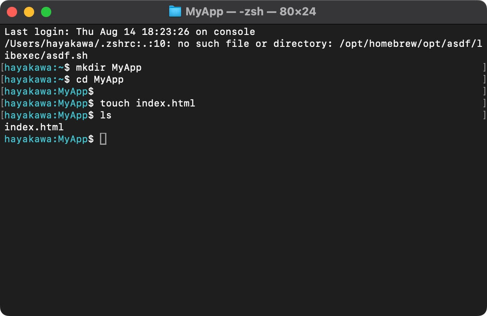

# デプロイ

htmlのコードを書くとき、VPSにログインしてvimでコードを書いていましたが、普通は手元のPCで自分の好きなエディタでコーディングしたいですよね。

ということで次は手元で作成したプログラム（ファイル）をVPSに配置していきます。このような作成したプログラムをVPSなど実際に動かす場所に置くことを「デプロイ」と言います。

### 手元のPCでファイルを作成する

まずはお手元のPCで作業用のディレクトリを作りましょう。GUIで作ってもいいですがせっかくなのでコマンドを実行して作ります。


カレントディレクトリを移動します。


今回デプロイさせたいファイルを作成します。名前は`index.html`としましょう。



任意のエディタで作成した`index.html`を開きます。


[以前作成したindex.htmlのコード](./04_create_html.md#htmlファイルの作成)をとりあえずコピペします。


この`index.html`を今回デプロイしたいわけですが、デプロイ前後の変化が分かるように適当にどこかの要素をいじっておきましょう。


### デプロイを行う

では実際にデプロイしていきます。下記のコマンドを実行してください。

```bash
rsync -avz -e "ssh -i {秘密鍵のパス}" {デプロイしたいディレクトリのパス} ubuntu@{vpsのipアドレス}:/var/www/html

# 実行例（カレントディレクトリ直下にindex.htmlがある状態の場合）
rsync -avz -e "ssh -i ~/.ssh/sakura" . ubuntu@133.242.156.111:/var/www/html
```


実行したらhtmlの表示をブラウザで確認したときと同様、ブラウザでVPSのURLにアクセスしてみてください。


表示が今回編集した通り変わっていたら成功です🎉

`rsync`とはファイルの同期を行うコマンドです。`cp`コマンドというファイルのコピーを行うコマンドもありますが、`rsync`は差分をチェックし差分のみを転送するため同期には最適です。

これで好きなエディタでコーディングができるようになり、好きなタイミングでデプロイを行えるようになりました👏